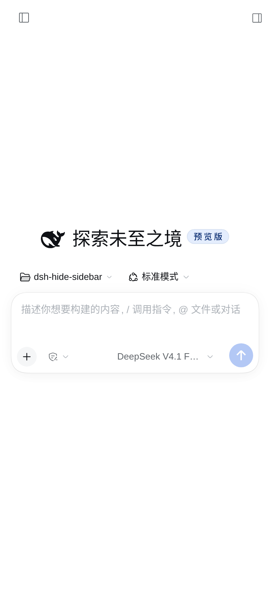
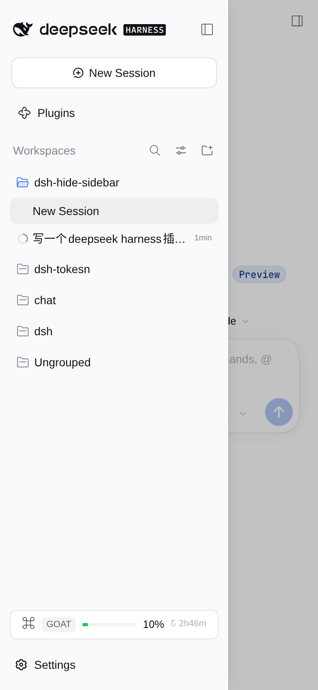
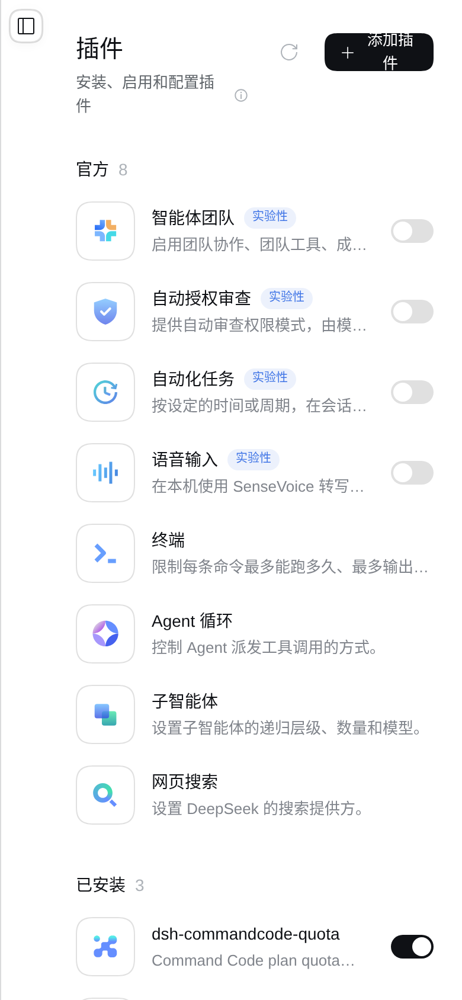
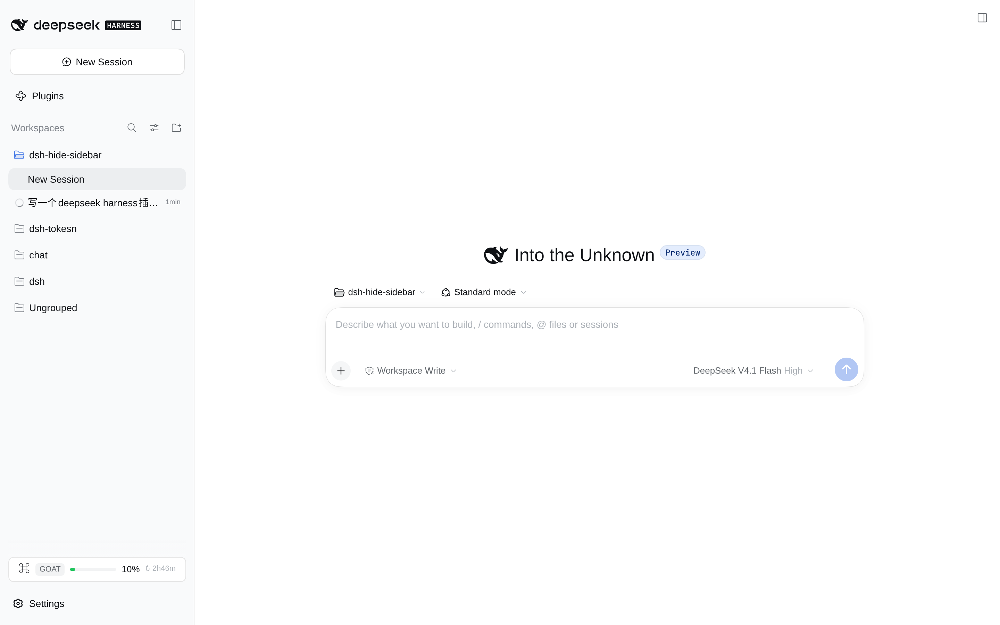
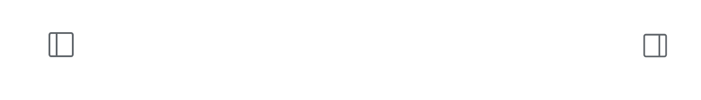

# dsh-hide-sidebar

给 [DeepSeek Harness](https://github.com/deepseek-ai/deepseek-harness)（`dsh`）的 Web 界面加一个**手机端的左侧栏**：窄屏下那条 56px 的图标细条不再常驻，改成一个顶部按钮——点一下，侧边栏从左边滑出来盖在内容上；选完会话或关掉蒙层，它自己收回去。

桌面（宽屏）完全不变：侧边栏该怎么停靠还怎么停靠，展开/收起、拖拽宽度、快捷键一个不少。

[English](README.md) | 中文



<p>


</p>

---

## 一、效果

窄屏（框架宽度 < 1024px，也就是 ui-layout 自己判断"该自动收起"的那个断点）下：

| | 之前 | 现在 |
| --- | --- | --- |
| 收起时 | 左侧常驻 56px 图标细条，占掉手机宽度的 1/7 | 细条消失，内容占满整宽 |
| 展开时 | 侧边栏挤占内容（内容只剩 ~110px） | 侧边栏浮在内容之上（280px 抽屉），内容不被压缩 |
| 怎么打开 | 细条上那个小箭头 | 顶部左侧的按钮（会话页在标题栏里，其他面板页浮在左上角） |
| 怎么关闭 | 再点一次箭头 | 点蒙层、侧边栏自己的收起按钮，或者**选完会话／面板自动收起** |

「选完自动收起」是有意做的：抽屉挡着内容不走的话，刚点的那个会话就被自己遮住了。判断用的是稳定钩子（`data-row-key`、`data-slot`）加 `aria-expanded`／`aria-haspopup`，不依赖会变的哈希类名和会翻译的 aria 文案——所以：

- 点会话行、点全局面板（Plugins）、点 Settings／底部动作 → 收起；
- 点会话行的「更多操作」、搜索、“视图选项”、Workspace 分组的展开箭头 → 保持打开（它们展开的东西就在抽屉里）。

宽屏下插件整体不生效（连按钮都不渲染），样式表里每一条规则都挂在 `html[data-dsh-hide-sidebar]` 上，而这个属性只在框架实测宽度小于断点时才被写上。



---

## 二、装

```sh
# 从 GitHub 装（钉在这次 push 的 commit 上）
dsh plugin --profile web add github:winniesi/dsh-hide-sidebar

# 或者本地目录（自己在改这个插件时用这个：pnpm 建的是 link，改完重载页面即生效）
dsh plugin --profile web add /path/to/dsh-hide-sidebar
```

装完**重载浏览器页面**即可（不用重启 dsh）。

桌面端（Electron）用应用里的**设置 → 插件 → Add plugin → Local directory**，填这个仓库的绝对路径，然后重启应用。

卸载：`dsh plugin --profile web remove dsh-hide-sidebar`。

### 改动哪一半需要什么才生效

| 改了 | 需要 |
| --- | --- |
| `client.js`（抽屉、按钮、样式、文案） | 重载浏览器页面 |
| `package.json` / `cordis.patch.yml` | 通常热重载自动重组合 |
| `index.js`（宿主半边，目前是空实现） | 重启 dsh |

---

## 三、它是怎么工作的

两个文件，各一半：`index.js` 是宿主端（**故意什么都不做**——这个插件不碰模型、不碰文件系统、不碰 Connection，只因为 Loader 的一行必须落到一个插件上才存在），全部逻辑在 `client.js` 这个手写 bundle 里（没有构建步骤，所以用 `React.createElement` 而不是 JSX，样式是一张注入的 `.dsh-hs-` 样式表）。

### 状态归 ui-layout，插件只做呈现

- 打开/关闭用的是 ui-layout 自己的窄屏开关：`ctx.layout.toggleSidebar()` 在视口小于 1024px 时翻的就是 `narrowExpanded`；
- 开/关状态直接读 ui-layout 自己的 `data-sidebar-collapsed` 属性，不另存一份；
- 断点也是实测框架宽度后跟 1024 比——和 ui-layout 量的是同一个盒子，不会出现"JS 认为窄、CSS 认为宽"的错位。

### 细条怎么消失的

框架的 `grid-template-columns` 是 React 写在内联样式上的三轨值。插件用一条 `!important` 规则把第一轨改成 `0px`，但**没有把侧边栏那一列移出文档流**——一移出去，后面的中列、右列会各自往前挪一轨（中列会跑到 0px 的轨道上）。所以列还是那个列（`position:relative; overflow:visible`），只是它里面的侧边栏根节点变成绝对定位的抽屉：

```
[data-slot="root"] > div               ← 框架，三轨网格
  ├─ div (侧边栏列)  position:relative, 0 宽
  │   └─ [data-slot="sidebar"] > *     ← 抽屉本体，absolute + translateX(-101%)
  ├─ centerCol
  └─ rightbarCol
```

- 关闭 = `translateX(-101%)`，被框架自己的 `overflow:hidden` 裁掉；
- 打开 = `translateX(0)`，0.26s 同一条缓动曲线；
- 抽屉宽度**不是写死的 280px**：桥接从框架内联样式里解析出第一轨（拖拽宽度就是它），第三轨（右侧面板的轨道）也一起发布成 CSS 变量，所以覆盖轨道列表不会把右侧面板挤到内容上。
- 侧边栏的组件树、滚动位置、portal 全程没有卸载，所以没有第二份会话列表，也不丢状态。

### 蒙层与两个按钮

- 蒙层挂在 frame 的 `shell.overlay` 槽位里：用的是应用自己的模态遮罩 token（`--dsw-alias-bg-mask-1` + `--dsw-mask-blur`），明暗主题跟着走；层级上抽屉（z-index 30）高于蒙层（overlayLayer 是 20），所以蒙层只压内容，不压抽屉。
- 按钮有两个座位，因为**会话页和其他面板页的顶部结构不一样**：
  - 会话页有现成的头部前导槽位 `conversation.header.leading`，按钮就放在标题栏里，**不额外占任何空间**；
  - Plugins／Schedules 这类面板页没有前导槽位，按钮就浮在框架左上角（`shell.overlay`），并给面板根节点加一条 40px 的透明左边框当留白（透明边框是"叠加"在面板原有内边距上，不覆盖它）。
- 右侧面板打开时（手机上它是全屏）浮标会藏起来：右侧面板有自己的收起按钮，而且 ui-layout 在开右侧面板时本来就会收起窄屏侧边栏。
- **图标就是官方那一个**，不是照着画的：从 `@deepseek-ai/dsh-client-ui-primitives` 原样抄来的 `IconPanelLeftOutlineRegular` —— 同样的 16px 方框、1px 描边、圆角矩形和取色 token。右上角"打开右侧栏"用的正是这份图形镜像之后的结果（`scaleX(-1)`），所以这里不镜像地用它，就是那个图标转 180°：两个角看起来是一家人。抄而不是 import，是因为 profile 里装的插件不该依赖 dsh 自带的包，而且 `require` 一旦失败会把整个 Web 启动一起带崩；离线检查会重新读本机安装的图形，这份拷贝哪天跟上游不一致就直接报错。



### 只用了公开接缝

`shell.overlay`、`conversation.header.leading`、`ctx.layout.toggleSidebar()`、`ctx.slots`、`ctx.locale`，加上 ui-layout 自己发布的 `data-sidebar-collapsed`。没有 import 任何 `@deepseek-ai/*` 运行时包（profile 里装的插件解析不到 dsh 自带的 `node_modules`），只依赖 React，以及浏览器原生的 `ResizeObserver` / `MutationObserver` / `:has()`。

---

## 四、自检

```sh
npm test          # = node test/smoke.mjs —— 离线检查，不需要浏览器
```

`test/smoke.mjs` 按模块加载器的真实方式加载 `client.js`（走 `window.__ModuleLoader__.load`），用桩上下文跑 `apply()`，再用 `react-dom/server` 把两个座位都渲染出来，共 50 项断言：

- 注册项（两个槽位、list 槽位的 id、locale、inject 面、`exports.inject`）；
- `splitTracks` 的括号嵌套、空值、单轨等边界；
- 帧状态观察者只在真的变化时通知；
- 渲染标记里有 `aria-label`／`aria-expanded`，没有 `undefined`／`NaN`；
- 样式表纪律：所有布局规则都被 `html[data-dsh-hide-sidebar]` 包着、没有字面色（hex/rgb/hsl）、**用到的每个 `--dsw-*` token 都在当前安装的主题里存在**（token 列表从本机 dsh 附带的那份主题包里读）；
- 图标一致性：两条 SVG path、viewBox、描边宽度都跟本机安装的 primitives 包里的原图形逐字比对 —— 抄歪了会测试失败，而不是悄悄看起来不对。

还有一类专门用来"找崩"的输入——组件在浏览器里一旦抛异常，整个槽位会**静默清空**，所以这些值得跑。

浏览器里的检查另有一条（需要正在运行的 dsh 和你正在看的那个已鉴权 URL）：

```sh
DSH_URL="http://127.0.0.1:3080/?token=…" node test/live-browser.mjs
```

它真的开一个 390×844 的手机视口和一个 1440×900 的宽视口，断言：细条离线、内联样式里仍是 56px、两个座位同一时刻只有一个可见、点开会滑出到左边缘、侧边栏自己的收起按钮能关掉、点会话行会自动收起、面板页有浮标和 40px 留白、宽屏完全未受影响、控制台没有报错。截图落在 `test/artifacts/`。

> 渲染检查不等于截图，截图也不等于手感。改完样式还是自己在手机上点一遍。

---

## 五、边界与兼容性

- **断点**：1024px，和 ui-layout 的 `SIDEBAR_AUTO_COLLAPSE` 一致，不额外暴露配置。
- **`:has()`**：样式里用了它（选侧边栏列、判断会话页）。Chrome 105+ / Safari 15.4+ / Firefox 121+ 支持——手机浏览器都在这条线以上。
- **右侧面板**：手机上打开右侧面板时浮标隐藏（面板自己有收起按钮，且开面板会顺手收起抽屉）。平板宽度（768–1023px）下右侧面板是停靠式带真实轨道，插件只覆盖第一轨、原样保留第三轨。
- **拖动侧边栏**：窄屏下把 resize 手柄隐藏了（`data-side="sidebar"`）——一个 8px 宽、`touch-action:none` 的条子横在抽屉右边只会吃掉滑动手势。
- 只用当前公开的接缝（见上）。dsh 的插件接口还在快速演进，槽位或属性若在 `0.2.x` 内改名，需要跟着改 `client.js` 顶部那几个常量。

## License

MIT
